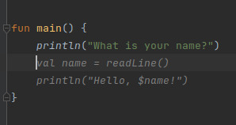
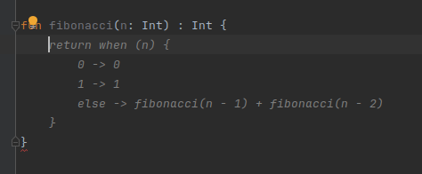
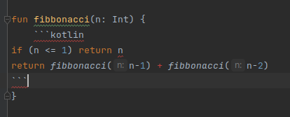

# Ollama Completions for Intellij

<!-- Plugin description -->
This plugin utilizes a local Ollama model (codellama) to provide inline completion suggestion for Intellij IDEs.

## Demonstration





## Requirements

Requires you to have Ollama setup and for the model to be running.

1. Make sure you have Ollama downloaded: [Official Instructions](https://ollama.com/download)
```
curl -fsSL https://ollama.com/install.sh | sh
```

2. Start the ollama server:
```
ollama serve
```

3. Pull model from ollama:
```
ollama pull codellama
```

## Installation

- From Releases:
  Download the [latest release](https://github.com/SushantPulavarthi/Intellijsense/releases/latest) and install it manually using
  <kbd>Settings/Preferences</kbd> > <kbd>Plugins</kbd> > <kbd>⚙️</kbd> > <kbd>Install plugin from disk...</kbd>

  
- Manually: 
  Clone the repository, and run the gradle task `buildPlugin`. This will build the distribution to `build/distribution`, which you can use to install the plugin to Intellij
```
git clone https://github.com/SushantPulavarthi/Intellijsense.git
cd Intellijsense
./gradlew buildPlugin
```

<!-- Plugin description end -->

## Limitations
The model is pretty inconsistent and does not always perform as intended. Therefore often it does not always provide relevant / correct suggestions.
It was also not feasible to run better models on my computer, and utilizing better models may provide better suggestions. Likewise, as it runs on a local model, the suggestions take up to a couple of seconds to generate, and it takes a while for the Ollama server to start up.

For example:



---
Plugin based on the [IntelliJ Platform Plugin Template][template].

[template]: https://github.com/JetBrains/intellij-platform-plugin-template
[docs:plugin-description]: https://plugins.jetbrains.com/docs/intellij/plugin-user-experience.html#plugin-description-and-presentation
